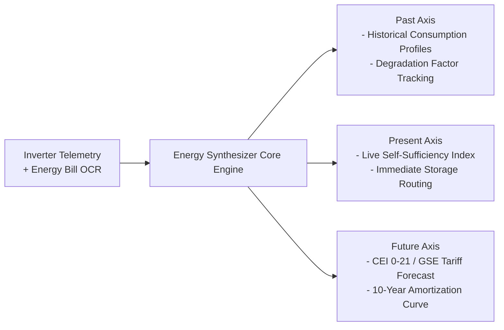

# Technical Architecture & Microservices Specification

## 1. Topography & Deployment Target

EnerlyAPP is deployed as a consolidated, lightweight microservices grid inside a dedicated Proxmox LXC Container:
* **Host Platform:** Proxmox VE Cluster
* **Target Container:** Container CT 116 (`192.168.10.101`)
* **OS:** Debian Minimal / Alpine Linux
* **Process Supervisor:** `supervisor.cjs` managing individual process lifecycles with health-check watchdog loops.

---

## 2. Microservices Directory & Port Map

| Service Name | Port | Primary Responsibilities |
| :--- | :--- | :--- |
| **Ingress API Gateway** | `3001` | SSL termination downstream, unified routing, in-process failover fallback |
| **securityService** | `3010` | JWT issuance, refresh tokens, role-based access control (RBAC), OAuth 2.0 |
| **usersData** | `3011` | User profile data, inverter registry, local OCR bill parsing |
| **usersLive** | `3012` | Server-Sent Events (SSE) telemetry pipeline, live dashboard metrics |
| **iaStudio** | `3013` | AI prompt engineering orchestration, task dispatching, context compression |
| **usersGuide** | `3014` | Technical documentation, user manuals, troubleshooting guides |
| **adminService** | `3015` | Isolated administrator APIs, platform metrics, audit trail logs |
| **AI Gateway Service**| `3002` | Interleaved generation, multi-provider LLM failover, rate limiting |
| **Database Pool** | `5432` | PostgreSQL 16 Alpine running in Docker with schema segregation |

---

## 3. Tri-Temporal Calculation Engine (Energy Synthesizer)

### Key Analytical Outputs:
1. **Self-Consumption Rate ($S_c$):** Real-time percentage of generated solar energy consumed on-site without grid injection.
2. **Deterministic Report Builder:** Fallback reporting capability rendering executive summaries in `< 20ms` without relying on external LLM calls.
3. **Regulatory Registry:** Hardware compatibility lookup table compliant with Italian grid codes (**CEI 0-21** and **TERNA** dispatching rules).

---

## 4. Zero-Knowledge OCR Security Model

Energy bills contain high-sensitivity Personal Identifiable Information (PII) including Italian Fiscal Codes (*Codice Fiscale*), IBANs, and precise grid withdrawal identifiers (*POD/PDR*).

The pipeline enforces a **Zero-Knowledge In-Memory Architecture**:
1. PDF/Image upload is parsed directly in browser/local runtime memory.
2. Regex and heuristic tokenizers extract strictly numeric energy fields:
   * Total kWh consumed across F1, F2, F3 tariff bands.
   * Peak committed power (kW).
   * Total euro expenditure before taxes.
3. All PII metadata is stripped before emitting the sanitized `BillOcrExtract` payload.
4. Downstream AI models only receive sanitized consumption numbers, guaranteeing full GDPR and privacy compliance.
