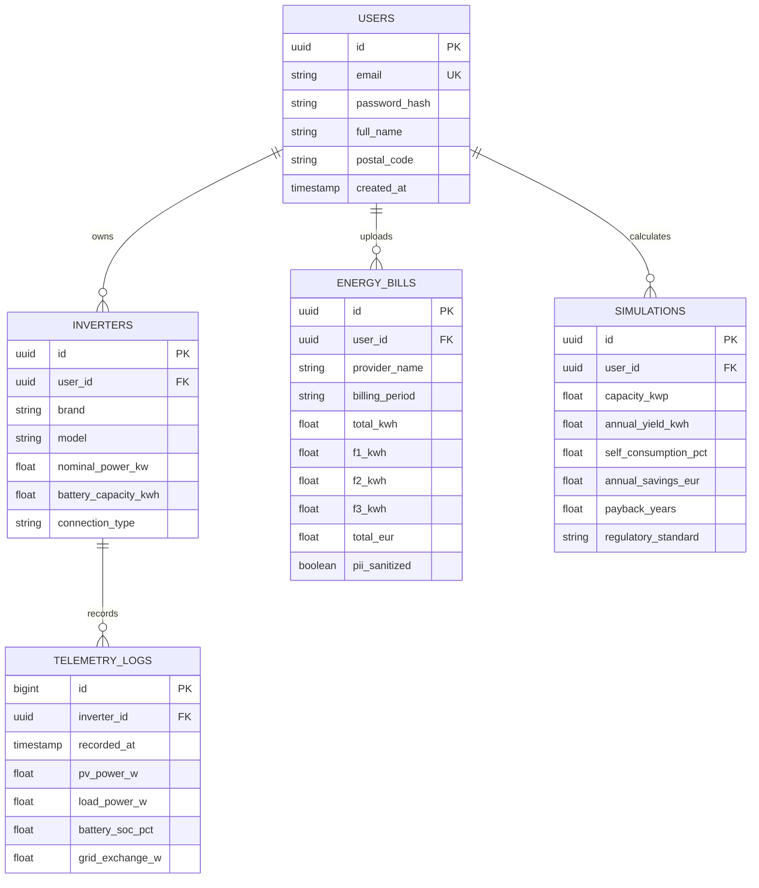
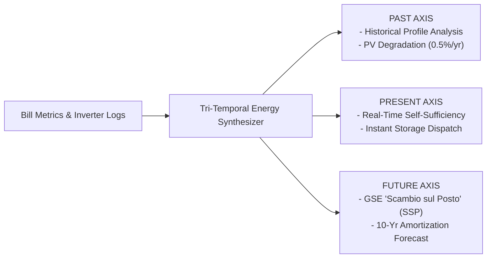
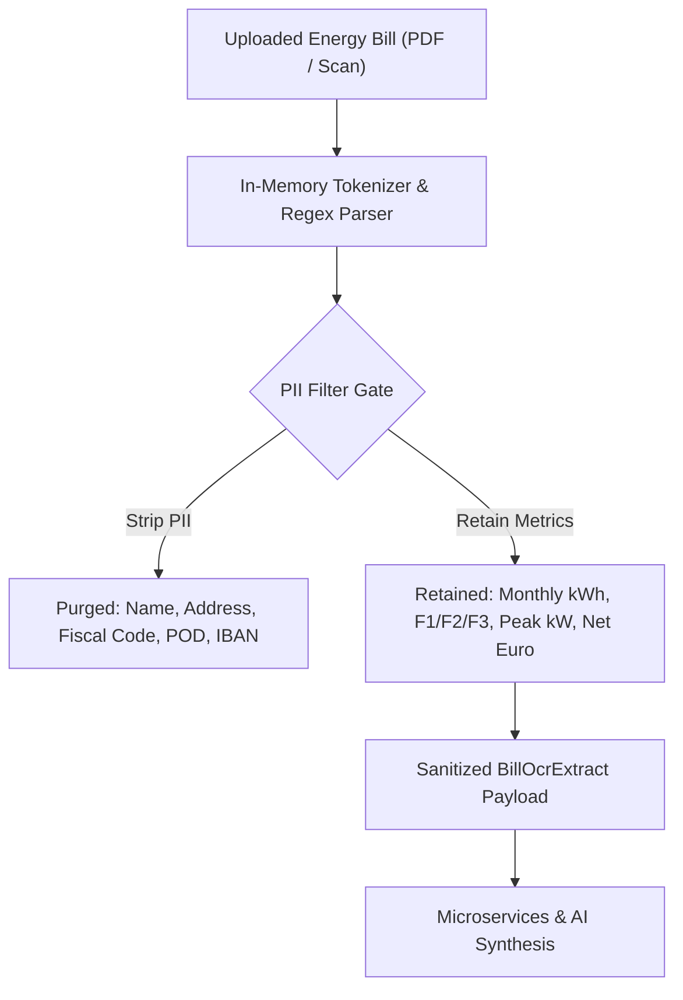

# EnerlyAPP — Deep Technical Architecture & Microservices Specification

This document details the engineering specifications for the **EnerlyAPP (EnergyLife Platform, [enerlyapp.com](https://enerlyapp.com/))**, covering its asynchronously decoupled microservices grid, localized Zero-Knowledge OCR ingestion, tri-temporal regulatory calculation models (CEI 0-21 / GSE SSP), and Model Context Protocol (MCP) agent supervision.

---

## 1. System Topology & Infrastructure Layout

EnerlyAPP is deployed as a consolidated, lightweight microservices mesh inside a high-performance Linux container hosted on an enterprise virtualization cluster:

* **Host Cluster:** Proxmox VE
* **Target Container:** Container CT 116 (`192.168.10.101`)
* **Base OS:** Debian 12 Minimal (Alpine runtime in Docker for PostgreSQL)
* **Ingress API Gateway:** `server/gateway/ingress.cjs` (Port 3001)
* **Process Supervisor:** `supervisor.cjs` managing individual process lifecycles with health-check watchdog loops.

```
       [ Vite React SPA Client ]         [ Administrator Dashboard UI ]
                   │                                     │
                   └─────────────────┐ ┌─────────────────┘
                                     ▼ ▼
                     ┌─────────────────────────────────┐
                     │   Nginx SSL Reverse Proxy       │
                     │   (Ports 80 / 443 Termination)  │
                     └────────────────┬────────────────┘
                                      │ HTTP / SSE
                                      ▼
                     ┌─────────────────────────────────┐
                     │ Ingress API Gateway (Port 3001) │
                     │  - Unified Path Routing         │
                     │  - In-Process Failover Fallback │
                     │  - Rate Limiting & Audit Guard  │
                     └────────────────┬────────────────┘
                                      │ Internal IPC / HTTP
         ┌──────────────┬─────────────┼──────────────┬─────────────┐
         ▼              ▼             ▼              ▼             ▼
   ┌───────────┐  ┌───────────┐ ┌───────────┐  ┌───────────┐ ┌───────────┐
   │securitySrv│  │ usersData │ │ usersLive │  │ iaStudio  │ │ adminSrv  │
   │ Port 3010 │  │ Port 3011 │ │ Port 3012 │  │ Port 3013 │ │ Port 3015 │
   └─────┬─────┘  └─────┬─────┘ └─────┬─────┘  └─────┬─────┘ └─────┬─────┘
         │              │             │              │             │
         └──────────────┴──────┬──────┴──────────────┴─────────────┘
                               ▼
            ┌──────────────────────────────────────┐
            │   PostgreSQL 16 Alpine (Port 5432)   │
            │  - Users, Inverters, Telemetry, Bills│
            └──────────────────────────────────────┘
                               ▲
                               │
            ┌──────────────────┴───────────────────┐
            │ AI Gateway & MCP Orchestrator        │
            │  - energylife_ai_gateway (Port 3002) │
            │  - Custom MCP Supervisor (Python)    │
            └──────────────────────────────────────┘
```

---

## 2. Microservices Directory & Endpoint Specifications

Each microservice runs as an autonomous Node.js process with an independent Process ID (`PID`), eliminating single points of failure across the domain layer:

### 2.1 `securityService` (Port 3010)
* **Scope:** Identity, authentication, authorization, and cryptographic token lifecycle.
* **Key Endpoints:**
  * `POST /api/auth/login`: Authenticates credentials and issues short-lived JWT access tokens + HTTP-only refresh cookies.
  * `POST /api/auth/refresh`: Rotates refresh tokens with anti-replay cryptographic revocation.
  * `GET  /api/auth/verify`: Fast in-memory token signature verification for upstream gateway caching.

### 2.2 `usersData` (Port 3011)
* **Scope:** User profiles, solar installation registries, and client-side bill OCR ingestion.
* **Key Endpoints:**
  * `GET  /api/user/profile`: Fetches installation parameters (PV capacity, inverter models, tariff contracts).
  * `POST /api/scan/bill`: Receives client-side sanitized bill payloads, validating numeric consistency against tariff rules.
  * `GET  /api/user/inverters`: Queries registered hardware hardware profiles and capacity ratings.

### 2.3 `usersLive` (Port 3012)
* **Scope:** Real-time event streaming and dashboard push updates.
* **Key Endpoints:**
  * `GET  /api/stream/events`: Server-Sent Events (SSE) pipe delivering sub-second power flows and state notifications.
  * `GET  /api/mobile/feed`: Compact polling snapshot for low-bandwidth mobile clients.
* **Keep-Alive Protocol:** Emits periodic heartbeat comments (`: ping\n\n`) every 15 seconds to keep intermediary proxy channels open.

### 2.4 `iaStudio` (Port 3013)
* **Scope:** AI task orchestration, prompt templating, and model context preparation.
* **Key Endpoints:**
  * `POST /api/modules/run`: Dispatches an analytical module (e.g., tariff optimization, degradation diagnosis).
  * `POST /api/ai/synthesize`: Coordinates interleaved execution between deterministic calculators and LLM synthesizers.

### 2.5 `usersGuide` (Port 3014)
* **Scope:** Static knowledge base, hardware compatibility tables, and regulatory guidance.
* **Key Endpoints:**
  * `GET /api/guide/faq`: Categorized FAQ entries.
  * `GET /api/guide/docs/:slug`: Markdown documentation renderer.

### 2.6 `adminService` (Port 3015)
* **Scope:** Isolated operational back-office, tenant quotas, and system telemetry.
* **Key Endpoints:**
  * `GET /api/admin/metrics`: Platform-wide ingestion volumes and error rate counters.
  * `GET /api/admin/audit-logs`: Immutable security event audit stream.

---

## 3. Database Entity Relationship (ER) Schema

The persistence layer is managed by PostgreSQL 16 Alpine running in an isolated Docker container with strict schema boundaries:



---

## 4. Tri-Temporal Energy Synthesizer (Normative CEI 0-21 / GSE SSP)

The core calculation engine operates across **three temporal axes**, executing in `< 20ms` with zero mandatory AI dependency:



### Mathematical Formulation of Scambio sul Posto (SSP):
Under Italian regulatory guidelines (GSE / ARERA), the economic compensation $C_s$ is determined by:

$$C_s = \min(O_e, C_e) + CUsf \cdot E_s$$

Where:
* $O_e$: Economic value of electricity injected into the grid ($E_i \times \text{PUN}_\text{orario}$).
* $C_e$: Total purchase expenditure for electricity drawn from the grid ($E_p \times \text{Prezzo Acquisto}$).
* $E_s$: Shared energy, defined as $\min(E_i, E_p)$.
* $CUsf$: Unit fee covering transmission and distribution system charges refunded by GSE.

---

## 5. Zero-Knowledge OCR Security Pipeline

Energy bills contain sensitive personal identifiers (Codice Fiscale, POD/PDR identifiers, customer address, IBAN). EnerlyAPP enforces a strict **Zero-Knowledge In-Memory Architecture**:



1. **Local-First Sanitization:** Files are processed strictly in ephemeral memory buffers.
2. **Deterministic Tokenizer:** Extracts numerical quantities, date intervals, and tariff tier ratios.
3. **Guaranteed Anonymization:** Downstream services and external LLM APIs only receive pure numerical matrices. Personal identity is cryptographically unlinked from consumption metrics.

---

## 6. Model Context Protocol (MCP) Supervisor Tooling

The platform exposes an audited Model Context Protocol interface (`energylife-mcp`) enabling AI coding assistants to inspect infrastructure health and validate microservice boundaries:

| MCP Tool Name | Execution Scope | Description |
| :--- | :--- | :--- |
| `energylife_architecture_schema` | Read-Only | Emits the complete microservices topology, port mappings, and gateway routes. |
| `energylife_app_status` | Read-Only | Probes HTTP endpoints of all 6 microservices and reports individual latency. |
| `energylife_list_dynamic_modules`| Read-Only | Enumerates active analytical modules registered in `iaStudio`. |
| `energylife_doc_lookup` | Read-Only | Queries indexed architectural guidelines and regulatory documentation. |
| `energylife_quick_lint` | Verification | Runs automated AST and schema checks against microservice configurations. |
| `energylife_deploy_to_proxmox` | Administrative | Orchestrates automated deployment of updated bundles to Proxmox CT 116. |
| `energylife_pve_status` | Read-Only | Queries hypervisor memory, CPU, and storage quotas for CT 116. |
| `energylife_remote_logs` | Read-Only | Streams recent systemd journal logs from CT 116. |
