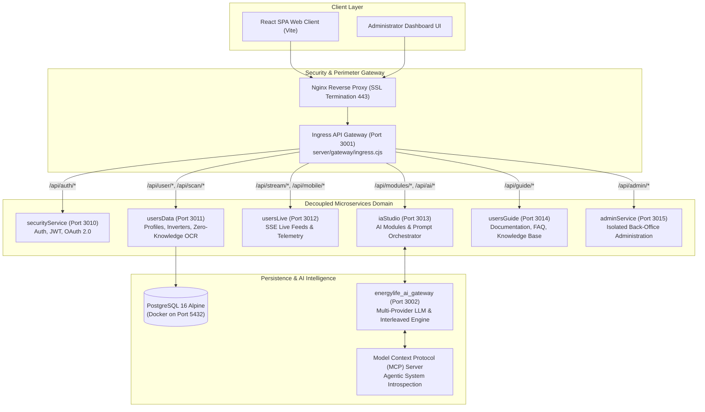

# EnerlyAPP (EnergyLife) — Architecture Showcase & Interface Specification

[](#)
[-purple.svg)](#)
[](#)
[](#)
[](#)

> **Public Architecture Showcase & API Specification**  
> This repository presents the architectural blueprint, data contracts, abstract service interfaces, and AI orchestration layers of **EnerlyAPP** (EnergyLife Platform, [enerlyapp.com](https://enerlyapp.com/)).  
> *Proprietary regulatory calculation algorithms (CEI 0-21 / GSE), proprietary OCR regex heuristics, and private infrastructure credentials are abstracted behind clean interfaces.*

---

## 🏛️ System Topology

EnerlyAPP adopts an **asynchronously decoupled microservices architecture** orchestrated by a centralized Ingress API Gateway, deployed on an enterprise virtualization cluster (**Proxmox VE Container CT 116**).



---

## 🌟 Core Architectural Innovations

### 1. Ingress Gateway with In-Process Resilience
The Ingress Gateway (`server/gateway/ingress.cjs`) routes incoming HTTP requests and WebSocket/SSE streams to discrete Node.js services running with independent process IDs (`PID`). If any microservice restarts, the Ingress Gateway serves immediate deterministic fallbacks, preventing client disconnects.

### 2. Tri-Temporal Energy Synthesizer
A deterministic core calculation engine operating across three distinct temporal axes:
* **Past (Historical):** Analyzes historical solar yield, degradation curves, and bill consumption patterns.
* **Present (Real-Time):** Computes instantaneous self-consumption, storage states, and grid imbalances.
* **Future (Predictive):** Simulates seasonal amortization, battery aging, and optimal tariff shifting according to Italian regulatory frameworks (**CEI 0-21 / GSE / TERNA**).

### 3. Local-First Zero-Knowledge OCR
Energy bill ingestion utilizes a client-side / local-first parsing layer (`billRegexParser`). Sensitive consumer data (fiscal codes, POD/PDR meters, bank details) are sanitized in-memory, ensuring zero leak of personal customer data to downstream LLM providers.

### 4. Agentic AI & Model Context Protocol (MCP)
An audited custom MCP Server (`energylife-mcp`) provides AI coding agents and autonomous workflows with full visibility into:
* Container health and Proxmox resource allocations.
* Live status across all 7 microservices.
* Architectural schema validation against technical specifications.

---

## 📂 Repository Structure

```text
├── README.md                      # System topology and architectural overview
├── ARCHITECTURE.md                # Comprehensive technical specification
├── LICENSE                        # Apache 2.0 Open Specification License
├── src/
│   ├── __init__.py
│   ├── models.py                  # Domain contracts (Telemetry, Bills, Simulations, User Profiles)
│   ├── interfaces.py              # Abstract interfaces (Gateway, Synthesizer, AI Orchestrator, OCR)
│   ├── stubs.py                   # Concrete specification stubs with encapsulated core logic
│   └── mcp_spec.py                # Model Context Protocol tooling for AI Agents
└── examples/
    └── simulated_demo.py          # Standalone simulation demonstrating the multi-service flow
```

---

## 🚀 Running the Quick Simulation

Execute the standalone Python verification bench without requiring external infrastructure:

```bash
# Clone the repository
git clone https://github.com/RedScorpio83/enerlyapp-architecture-showcase.git
cd enerlyapp-architecture-showcase

# Run the simulation (standard library only)
python examples/simulated_demo.py
```

### Example Simulation Output:
```text
[EnerlyAPP] Initializing Ingress API Gateway (Port 3001) & 6 Domain Microservices...
[Ingress Gateway] Routing /api/scan/bill -> ZeroKnowledgeOcrParser (Local-First Sanitization)...
      ✓ Bill Parsed: Provider=Enel Energia | Monthly Consumption=420 kWh | Peak Power=4.5 kW
[State Engine] Executing Tri-Temporal Energy Synthesizer (CEI 0-21 / GSE Model)...
      ✓ Self-Consumption: 78.4% | Annual Savings Forecast: € 1,140.00 | Payback: 4.8 Years
[MCP Agent Tool] Invoked 'energylife_architecture_schema' -> 6 Microservices Verified Healthy (CT 116)
```

---

## 🛡️ Intellectual Property Isolation

* **Publicly Disclosed:** Microservice interface contracts, topological flow designs, zero-knowledge parsing schemas, and MCP tool specifications.
* **Encapsulated & Protected:** Production cryptographic secrets, certified GSE tariff coefficients, and internal SQL migration manifests.

---

## 👨‍💻 Author

**Alessandro Caliciotti**  
*Lead Enterprise Solutions & AI Systems Architect*  
* [GitHub: @RedScorpio83](https://github.com/RedScorpio83)
