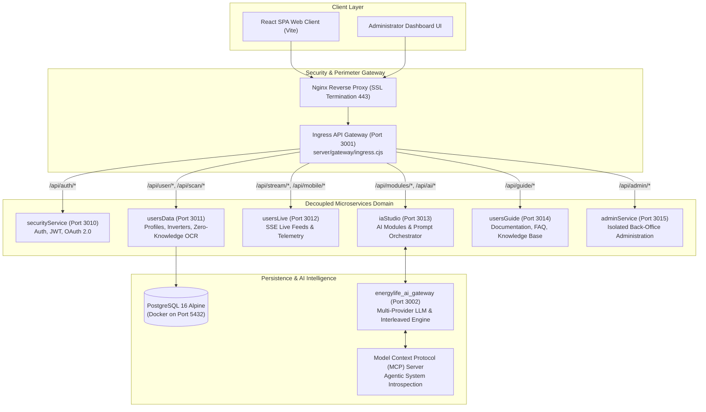

# EnerlyAPP (EnergyLife) — Architecture Showcase & Interface Specification

[](#)
[-purple.svg)](#)
[](#)
[](#)
[](#)

> **Public Architecture Showcase & API Specification**  
> This repository presents the architectural blueprint, data contracts, abstract service interfaces, and AI orchestration layers of **EnerlyAPP** (EnergyLife Platform, [enerlyapp.com](https://enerlyapp.com/)).  
> *Proprietary regulatory calculation algorithms (CEI 0-21 / GSE), proprietary OCR regex heuristics, and private infrastructure credentials are abstracted behind clean interfaces.*

---

## 🏛️ System Topology

EnerlyAPP adopts an **asynchronously decoupled microservices architecture** orchestrated by a centralized Ingress API Gateway, deployed on an enterprise virtualization cluster (**Proxmox VE Container CT 116**).



---

## 🌟 Core Architectural Innovations

### 1. Ingress Gateway with In-Process Resilience
The Ingress Gateway (`server/gateway/ingress.cjs`, Port 3001) routes incoming HTTP requests and WebSocket/SSE streams to discrete Node.js services running with independent process IDs (`PID`). If any microservice restarts, the Ingress Gateway serves immediate deterministic fallbacks, preventing client disconnects.

### 2. Tri-Temporal Energy Synthesizer (CEI 0-21 / GSE Model)
A deterministic analytical calculation engine operating across three distinct temporal axes in `< 20ms` with zero mandatory AI dependency:
* **Past (Historical):** Analyzes historical solar yield, degradation curves, and bill consumption patterns.
* **Present (Real-Time):** Computes instantaneous self-consumption, storage states, and grid imbalances.
* **Future (Predictive):** Simulates seasonal amortization, battery aging, and optimal tariff shifting according to Italian regulatory frameworks (**CEI 0-21 / GSE SSP**).

### 3. Local-First Zero-Knowledge OCR
Energy bill ingestion utilizes a client-side / local-first parsing layer (`billRegexParser`). Sensitive consumer data (fiscal codes, POD/PDR meters, bank details) are sanitized in-memory, ensuring zero leak of personal customer data to downstream LLM providers.

### 4. Agentic AI & Model Context Protocol (MCP)
An audited custom MCP Server (`energylife-mcp`) provides AI coding agents and autonomous workflows with full visibility into container health, microservices topology, and runtime diagnostics on Proxmox CT 116.

---

## 🔌 Microservices Port & Responsibility Directory

| Microservice | Port | Primary Responsibilities |
| :--- | :--- | :--- |
| **Ingress API Gateway** | `3001` | Unified routing, SSL reverse proxy downstream, in-process failover fallback |
| **securityService** | `3010` | JWT authentication, refresh token rotation, OAuth 2.0, RBAC |
| **usersData** | `3011` | User profile registry, inverter hardware catalog, zero-knowledge bill OCR |
| **usersLive** | `3012` | Server-Sent Events (SSE) telemetry pipeline, live dashboard metrics |
| **iaStudio** | `3013` | AI prompt engineering orchestration, task dispatching, context compression |
| **usersGuide** | `3014` | Technical documentation, user manuals, troubleshooting guides |
| **adminService** | `3015` | Isolated administrator APIs, platform metrics, audit trail logs |
| **AI Gateway Service**| `3002` | Interleaved generation, multi-provider LLM failover, rate limiting |
| **PostgreSQL Pool** | `5432` | PostgreSQL 16 Alpine running in Docker with schema segregation |

---

## 🤖 Model Context Protocol (MCP) Tool Suite

| MCP Tool Name | Execution Scope | Description |
| :--- | :--- | :--- |
| `energylife_architecture_schema` | Read-Only | Emits full microservice topology, port maps, and gateway routes. |
| `energylife_app_status` | Read-Only | Probes HTTP endpoints of all 6 microservices and reports latency. |
| `energylife_list_dynamic_modules`| Read-Only | Enumerates active analytical modules registered in `iaStudio`. |
| `energylife_doc_lookup` | Read-Only | Queries indexed architectural guidelines and regulatory documentation. |
| `energylife_quick_lint` | Verification | Runs automated AST and schema checks against microservice configurations. |
| `energylife_deploy_to_proxmox` | Administrative | Orchestrates automated deployment of updated bundles to Proxmox CT 116. |
| `energylife_pve_status` | Read-Only | Queries hypervisor memory, CPU, and storage quotas for CT 116. |

---

## 📂 Repository Structure

```text
├── README.md                      # System topology and architectural overview
├── ARCHITECTURE.md                # Deep-dive technical specifications & ER database schema
├── LICENSE                        # Apache 2.0 Open Specification License
├── src/
│   ├── __init__.py
│   ├── models.py                  # Domain contracts (Telemetry, Bills, Simulations, User Profiles)
│   ├── interfaces.py              # Abstract interfaces (Gateway, Synthesizer, AI Orchestrator, OCR)
│   ├── stubs.py                   # Concrete specification stubs with encapsulated core logic
│   └── mcp_spec.py                # Model Context Protocol tooling for AI Agents
└── examples/
    └── simulated_demo.py          # Standalone simulation demonstrating the multi-service flow
```

---

## 🚀 Running the Quick Simulation

Execute the standalone Python verification bench without requiring external infrastructure:

```bash
# Clone the repository
git clone https://github.com/RedScorpio83/enerlyapp-architecture-showcase.git
cd enerlyapp-architecture-showcase

# Run the simulation (standard library only)
python examples/simulated_demo.py
```

### Example Simulation Output:
```text
======================================================================
  ENERLYAPP (ENERGYLIFE) ARCHITECTURAL SHOWCASE -- SIMULATION DEMO
  Author: Alessandro Caliciotti (@RedScorpio83)
======================================================================

[1/4] Initializing Ingress API Gateway (Port 3001) & 6 Domain Microservices...
      [OK] Ingress Gateway up on port 3001 with in-process failover fallback.

[2/4] Parsing Energy Bill via Zero-Knowledge OCR In-Memory Pipeline...
      • Provider:           Enel Energia S.p.A.
      • Total Consumption:  420.0 kWh (Bimestre Luglio - Agosto)
      • Peak Power Meter:   4.5 kW
      • Net Expenditure:    € 126.80
      • Privacy Guard:      PII Sanitized = True (Zero PII forwarded to LLM)

[3/4] Executing Tri-Temporal Energy Synthesizer (Italian Regulatory CEI 0-21 Model)...
      • Planned Capacity:   6.0 kWp (Storage: 10 kWh)
      • Estimated Yield:    8100.0 kWh/year
      • Self-Consumption:   85.0%
      • Annual Net Savings: € 2049.30 / year
      • Estimated Payback:  5.4 years
      • Engine Latency:     16.8 ms (Deterministic 0-AI fallback)

[4/4] Model Context Protocol (MCP) Execution by AI Agent...
      Agent calls tool: 'energylife_cluster_health'
      Cluster Status: HEALTHY (6 services online on CT 116)
      Agent calls tool: 'energylife_architecture_schema'
      Deployment Target: Proxmox LXC Container CT 116 (192.168.10.101)
```

---

## 🛡️ Intellectual Property Isolation

* **Publicly Disclosed:** Microservice interface contracts, topological flow designs, zero-knowledge parsing schemas, and MCP tool specifications.
* **Encapsulated & Protected:** Production cryptographic secrets, certified GSE tariff coefficients, and internal SQL migration manifests.

---

## 📖 Further Reading

For complete database ER schemas, mathematical formulas for GSE Scambio sul Posto (SSP), and endpoint definitions, see:  
👉 **[ARCHITECTURE.md](ARCHITECTURE.md)**

---

## 👨‍💻 Author

**Alessandro Caliciotti**  
*Lead Enterprise Solutions & AI Systems Architect*  
* [GitHub: @RedScorpio83](https://github.com/RedScorpio83)
